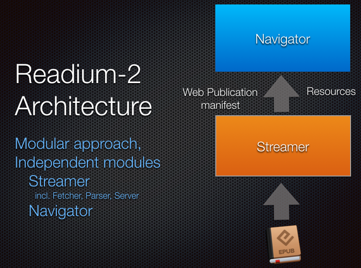

# Readium Architecture

All Readium implementations (mobile, desktop or Web app) are split in two main modules, which use HTTP for exchanging data, may therefore be running on different systems, and may be written in different languages. 

One module contains a parser for packaged publications (EPUB or CBZ today), generates a Readium Web Publication Manifest and exposes every resource of the publication via an HTTP server; we call it a "streamer", as it exposes the individual resources of the publication. 

Another module processes the Web Publication Manifest, renders the publication (usually on screen) and handles user navigation; we call it a "navigator". 

## Modules

### Main Modules

* [Streamer](streamer)
* [Navigator](navigator)
* [Web Publication Manifest](https://github.com/readium/webpub-manifest)
* [Readium CSS](https://github.com/readium/readium-css)
* [Locators](locators)

### Services

* [Location Resolver](locators/resolver.md)
* [Media Overlay](media-overlay)
* [Positions List](positions)
* [Search](search)

## Active Projects

### iOS / Swift

For an overview of how Readium-2 on iOS works, we highly recommend taking a look at the [iOS Test App](https://github.com/readium/r2-testapp-swift).

The Test App integrates the following modules (all written in Swift) into a single iOS application:

* [Shared Model](https://github.com/readium/r2-shared-swift)
* [Streamer](https://github.com/readium/r2-streamer-swift)
* [Navigator](https://github.com/readium/r2-navigator-swift)

This app is currently tested on TestFlight by a first batch of alpha testers.

### Android

The Android implementation is still catching up with iOS in early 2018, but has now reached a stage where it can be built and tested by any developer.

For an overview of how Readium-2 on Android works, we highly recommend taking a look at the [Android Test App](https://github.com/readium/r2-testapp-kotlin).

The Test App integrates the following modules (all written in Kotlin) into a single Android application:

* [Shared Model](https://github.com/readium/r2-shared-kotlin)
* [Streamer](https://github.com/readium/r2-streamer-kotlin)
* [Navigator](https://github.com/readium/r2-navigator-kotlin)

This app is currently tested on HockeyApp by a first batch of alpha testers.

An earlier [Java implementation of the streamer](https://github.com/readium/r2-streamer-java) is available as well, but Kotlin is the preferred target language in the Readium-2 community.

### JavaScript

EDRLab is actively working on a production app called [Readium Desktop](https://github.com/edrlab/readium-desktop) built on top of a [Typescript-based implementation of the streamer](https://github.com/edrlab/r2-streamer-js).

There are also two projects implementing a JS-based navigator:

* [webpub-viewer](https://github.com/NYPL-Simplified/webpub-viewer) - An iframe-based navigator, written in TypeScript (NYPL)
* [epub.js](https://github.com/futurepress/epub.js/) - Support for the streamer is in development as part of the v0.3 release (Future Press)

### Go

The first implementation of a streamer was written in Go, mostly for server-side deployment.

This project is active and [hosted on this organization](https://github.com/readium/r2-streamer-go).

## Prototypes

* [webpub-viewer](https://github.com/HadrienGardeur/webpub-viewer) - An `iframe` based navigator, written in JS (Hadrien Gardeur)
* [comics-viewer](https://github.com/HadrienGardeur/comics-viewer) - An `img` based navigator for comics, written in JS (Hadrien Gardeur)
* [audiobook-player](https://github.com/HadrienGardeur/audiobook-player) - An `audio` based navigator for audiobooks, written in JS (Hadrien Gardeur)

## Keeping Track

There are multiple ways to keep track of the on-going activity and participate:

* discussions on [the issue tracker](https://github.com/readium/readium-2/issues)
* action items and epics on [the project board](https://github.com/readium/readium-2/projects/1)
* weekly calls with [our archive of meeting notes and recordings](https://drive.google.com/drive/folders/0BzaNaBNAB6FjbzR5NWFVWVo2dDg?hl=en)
* multiple channels on the [Slack team for Readium](https://readium.slack.com) ([#readium-2](https://readium.slack.com/messages/readium-2/), [#r2-swift](https://readium.slack.com/messages/r2-swift/) and [#r2-java](https://readium.slack.com/messages/r2-java/))
