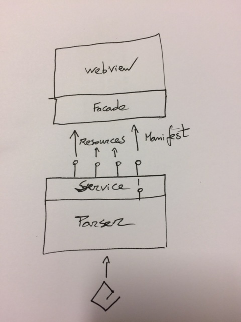

# Architecture for Readium-2 Streamer

> **Note:** need to find a name for this project.

In every Readium-2 implementation (mobile, desktop or Web app) appear two main runtimes, which may be in different processes or on differents systems. One contains the webview and associated rendering application, let's call it the "frontend", and the other contains the EPUB parser and the associated marshaling service, that we could call the "backend". 

 

## Features of the parser

* access EPUB files or exploded EPUBs 
* parse EPUB 2.x and 3.x
* decrypt and deobfuscate resources contained in the EPUB container
* pre-process HTML and SVG documents
* expose in-memory data model for EPUB

## Features of the marshaling service
* expose to the frontend 
 * the EPUB manifest (JSON),
 * the Media Overlays (JSON),
 * the LCP License Document (JSON),
 * every resource from the EPUB container
 
* provide a pluggable API for other modules exposed in HTTP (search, locator resolver)

## EPUB manifest as an Interchange Format

Initial work on the interchange format will be based on the [Web Publication Manifest](https://github.com/HadrienGardeur/webpub-manifest) with potential extensions and improvement to that draft through the following means:

* additional metadata for the default context or an additional Readium-2 context
* new collection roles
* new relationships
* new properties for the link object

## SMIL Media Overlay Resolver

> **Action Item:** Define a new JSON document format for this resolver.

## Content Injection

On some platforms, injecting JS, CSS and links directly at a parser level will be necessary.

The following features might be necessary:

* provide a configuration file to indicate CSS and JS resources that need to be injected in all HTML resources
* support for navigator.epubReadingSystem

Injecting links to related resources could also prove to be useful:

* link to next/previous resource
* link to the manifest itself

That said, it's worth considering whether such links should show up in the content itself or in HTTP headers.

## Decryption & Deobfuscation

For decryption, speed is the key. We need to make sure that this has minimal impact on performance which means:

* for languages that provide high performance, hardware-based optimisations, we can directly rely on native code
* for the rest, we should probably rely on C++

We might also need a generic interface to handle this feature, something that could look like Readium-1 Content Filters/Modules, but that will probably be quite different in each language.

## HTTP details

Purely in terms of speed, we need to optimize how we handle HTTP using both HTTP caching and HTTP/2 push (when available).

For caching, using `Cache-Control` is the most efficient technique:

* after the first request, an HTTP client will keep the response in cache for a period of time that we can control
* for subsequent requests, if the cache is still valid, the response will be served directly from the cache without any additional request

If we rely on `Last-Modified` or `ETag` instead:

* after the first request, an additional request remains necessary to validate that the resource has not been modified
* calculating the `Last-Modified` or `ETag` has a performance impact on the server side

`Cache-Control` requires the usage of unique URIs per publication and resource, in order to avoid a situation where the cache would serve a resource from the wrong publication, or an older version of the same publication.

This will have an impact on how we expose resources from our publication, which will require using both a publication identifier and a modification date (based on metadata in EPUB 3.x and on a system specific timestamp for EPUB 2.x) in our URIs.

HTTP/2 push opens the door to a brand new world for optimization:

* should we push all non-audio/video resources when we first access a publication?
* should we push instead the next/previous item in the spine?
* can we detect the resources that will be used in an HTML/SVG document and push those?

It's also worth considering whether HTTP/2 push is necessary, since the interchange format already allows RS to pre-fetch spine items and resources.

## Plugins

Readium-2 Streamer must also provide an easy way to add and expose modules in HTTP.

To provide a good plugin architecture, we need generic APIs to:

* configure which plugins are being used
* expose additional links in the manifest
* add new routes to the HTTP server
* handle incoming requests from the HTTP server

## Security

> **Related issues:** Both [#17 Security aspects of using an HTTP Server](https://github.com/readium/readium-2/issues/17) and [#18 Reading System Security](https://github.com/readium/readium-2/issues/18) are relevant here.
